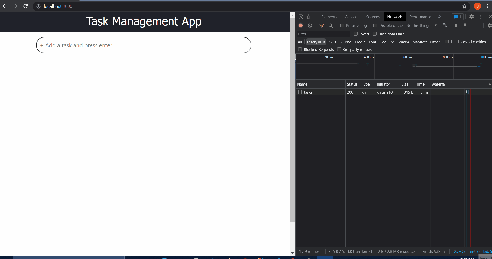

# TaskManagementApp
A Task Management App using SpringBoot,mongoDB and React.js.

-----------------------------------------------------------------------

-----------------------------------------------------------------------
APIs
Methods	    Urls	                            Actions
POST	    /api/task/add               	    create new Task
GET	        /api/tasks                          retrieve all Tasks
PUT     	/api/task/complete/:id              update a as completed and uncompleted by :id
DELETE  	/api/task/:id	                    delete the task by :id

-----------------------------------------------------------------------

Technologies required
    Java
    Spring Boot
    MongoDB
    Maven
    React

-----------------------------------------------------------------------

For Running this project.

1.Clone Repository and open project in terminal
1.Run Spring Boot Server from root directory with Maven command: mvn spring-boot:run.
2.Now change directory using cd/react-frontend (FrontEnd React project is in this directory ).
3.npm install.
4.npm start.
5.Now the project will be accessible in localhost.

-------------------------------------------------------------------------
